# Welcome to Docker

This is a repo for new users getting started with Docker.

You can try it out using the following command.
```
docker run -d -p 8088:80 --name welcome-to-docker docker/welcome-to-docker
```
And open `http://localhost:8088` in your browser.

# Building

Maintainers should see [MAINTAINERS.md](MAINTAINERS.md).

Build and run:
```
docker build -t welcome-to-docker . 
docker run -d -p 8088:3000 --name welcome-to-docker welcome-to-docker
```
Open `http://localhost:8088` in your browser.

### VISUALISATION DE L'EXERCICE

D'abord, j'ai construis mon container "welcome-to-docker". il ressemblait à celà:

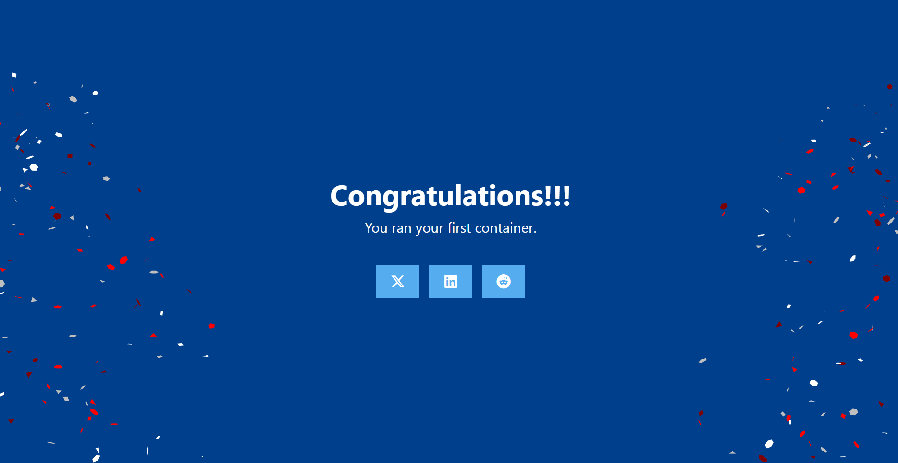

2.J'ai ensuite modifié Le CSS de base dans App.css ainsi que le message d'affichage dans App.js:

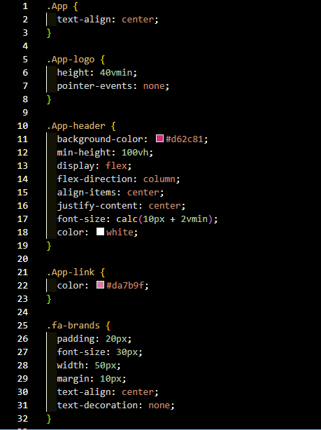
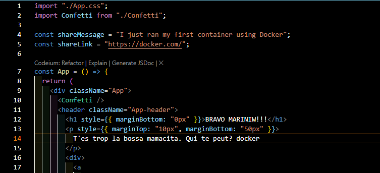

3. Pour que les modifications soient visibles, j'ai d'abbord stoppé puis supprimé mon container, puis je l'ai built et run de nouveau. 

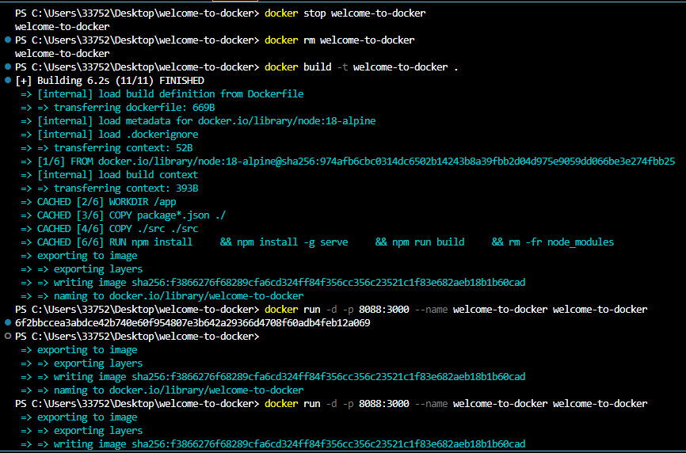
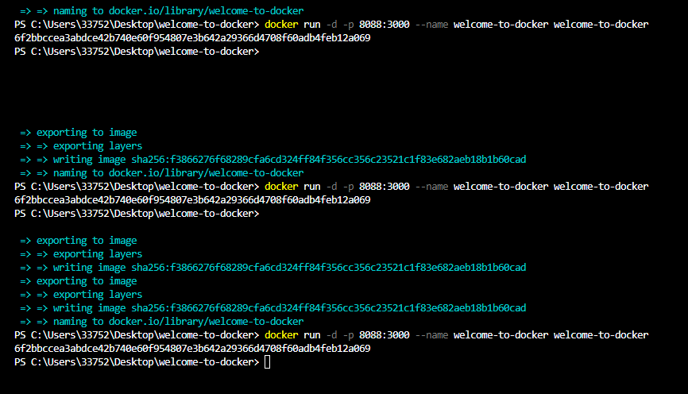

4. Voilà le résultat des modifications:

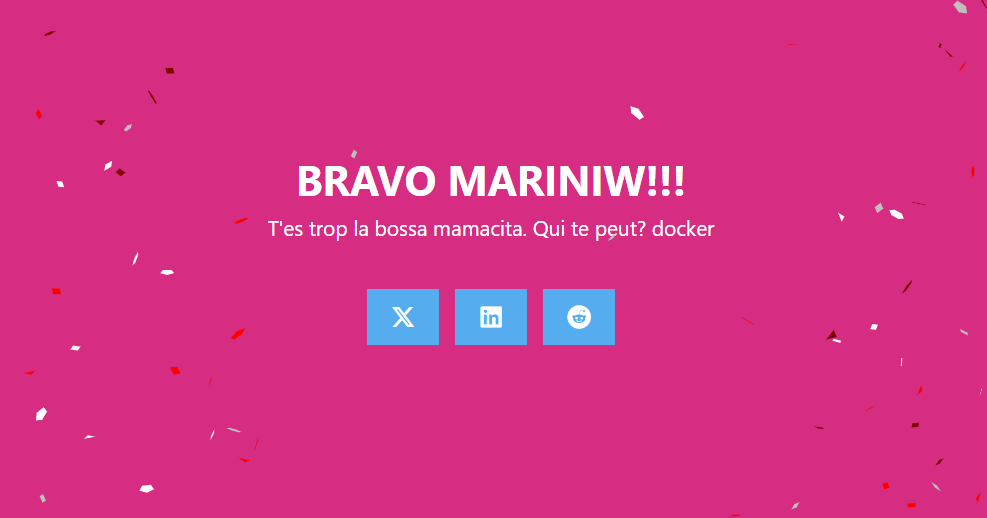

### PARTAGE DE L'IMAGE

1. Tout d'abord, je dois me connecter à l'aide de la commmande "docker login -u <username>".

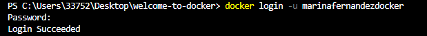

2. Puis Je rajoute un tag à mon image, mon pseudo ainsi que "latest"

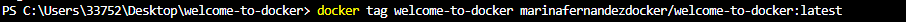

3. Puis j'effectue mon partage avec un push.

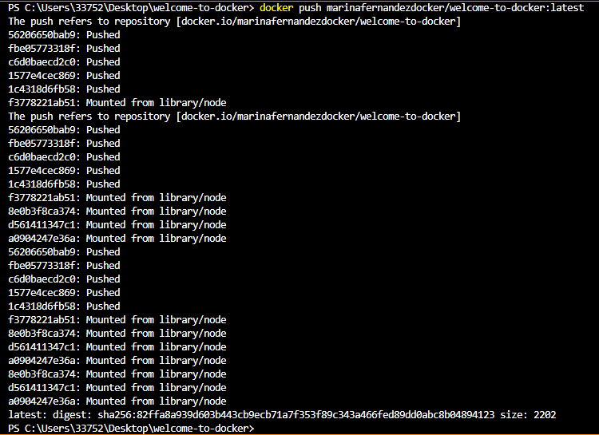

### RECUPERATION DE L'IMAGE D'UN COLLABORATEUR 

1.J'ai choisi de récupérer l'image de ma collègue Aicha, et pour ce faire j'ai utilisé un pull avec son pseudo et le nom de son image:

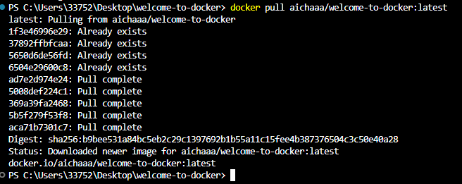

2. Je la lance pour ensuite la visualier dans le navigateur:


Comme on peut le voir, je peux effectivement la visualiser:


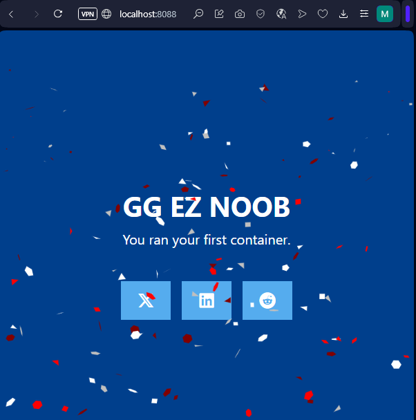


