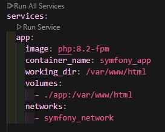
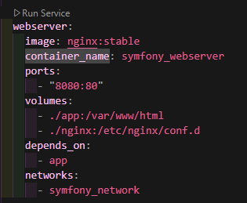
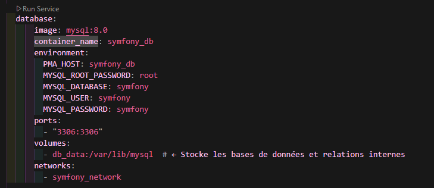
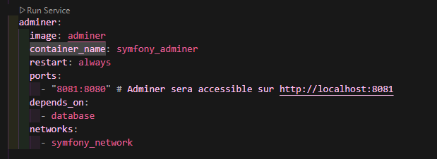
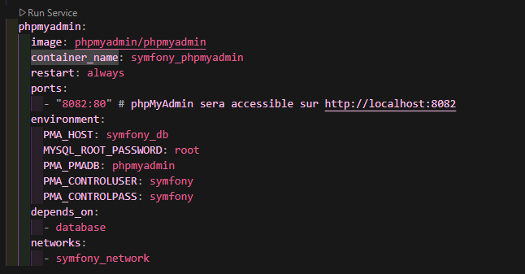
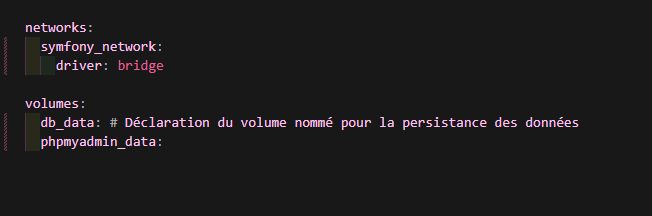
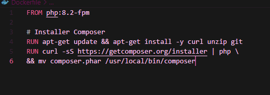

# JOUR 1 - JOB 01 - SYMFONY

## DESCRIPTION DU DOCKER-COMPOSE.YML

### Bloc 1

* services: indique que l’on définit des services Docker à exécuter.

* app: est le nom du service que l’on configure.

* image: php:8.2-fpm spécifie que le conteneur utilisera l’image officielle de PHP 8.2 en mode FPM.

* container_name: symfony_app donne un nom personnalisé au conteneur, ce qui facilite son identification.

* working_dir: /var/www/html définit le dossier dans lequel le conteneur exécutera les commandes.

* volumes: permet de partager des fichiers entre l’ordinateur et le conteneur.
  
* ./app:/var/www/html relie le dossier ./app de l’ordinateur au dossier /var/www/html dans le conteneur, pour synchroniser les fichiers.
  
* networks: indique que le conteneur sera connecté à un réseau Docker.

* symfony_network ajoute ce conteneur au réseau nommé symfony_network, ce qui permet la communication avec d’autres services (comme une base de données).

### BLOC 2

* webserver: définit le nom du service, ici un serveur web.

* image: nginx:stable utilise l’image Docker officielle de Nginx en version stable.

* container_name: symfony_webserver attribue un nom personnalisé au conteneur pour faciliter son identification.

* ports: permet de rediriger les connexions entre l’ordinateur hôte et le conteneur.

* "8080:80" signifie que le port 8080 de l’ordinateur est lié au port 80 du conteneur, permettant d’accéder au serveur via http://localhost:8080. 

* volumes: partage des fichiers entre l’ordinateur et le conteneur.

* ./app:/var/www/html synchronise le dossier ./app de l’ordinateur avec /var/www/html dans le conteneur, où se trouvent les fichiers du site.
 
* ./nginx:/etc/nginx/conf.d permet de fournir des fichiers de configuration personnalisés pour Nginx depuis le dossier ./nginx.
  
* depends_on: définit une dépendance avec un autre service.

* app indique que ce service attend que l’application PHP (app) soit lancée avant de démarrer.
networks: connecte le conteneur à un réseau Docker.

*symfony_network relie le conteneur au réseau symfony_network, permettant la communication avec d’autres services (comme l’application PHP).

### BLOC 3

* database: définit le nom du service, ici une base de données MySQL.

* image: mysql:8.0 utilise l’image officielle de MySQL 8.0 pour ce conteneur.

* container_name: symfony_db donne un nom personnalisé au conteneur, facilitant son identification.

* environment: définit les variables d’environnement pour configurer MySQL.

* PMA_HOST: symfony_db définit le nom d’hôte pour phpMyAdmin (si utilisé).

* MYSQL_ROOT_PASSWORD: root fixe le mot de passe de l’utilisateur root à root.

* MYSQL_DATABASE: symfony crée une base de données appelée symfony au démarrage.

* MYSQL_USER: symfony crée un utilisateur MySQL nommé symfony.

* MYSQL_PASSWORD: symfony assigne le mot de passe symfony à cet utilisateur.
  
* ports: établit une liaison entre le port MySQL du conteneur et celui de la machine hôte.

* "3306:3306" signifie que le port 3306 du conteneur est accessible via le port 3306 de la machine hôte, permettant de se connecter à MySQL depuis l’extérieur.

* volumes: permet de stocker les données MySQL pour éviter de les perdre à la suppression du conteneur.

* db_data:/var/lib/mysql sauvegarde les bases de données dans un volume persistant.

* networks: connecte le conteneur à un réseau Docker.

* symfony_network relie la base de données aux autres services du projet, comme l’application PHP.
Ce service est essentiel pour stocker et gérer les données d’une application Symfony ou toute autre application web utilisant MySQL.

### BLOC 4 

* adminer: définit le nom du service, ici un conteneur Adminer.

* image: adminer utilise l’image officielle d’Adminer, qui est une interface web pour gérer des bases de données (MySQL, PostgreSQL, etc.).

* container_name: symfony_adminer donne un nom personnalisé au conteneur pour faciliter son identification.

* restart: always indique que le conteneur redémarrera automatiquement en cas d’arrêt ou de crash.

* ports: permet d’accéder à Adminer depuis un navigateur.

* "8081:8080" signifie que le port 8081 de l’ordinateur hôte est redirigé vers le port 8080 du conteneur, permettant d’accéder à Adminer via http://localhost:8081.

* depends_on: définit que ce service dépend d’un autre service.
  
* database signifie qu’Adminer ne démarrera qu’après le service database (MySQL).

* networks: connecte Adminer au réseau Docker.
 
* symfony_network relie Adminer aux autres services du projet, permettant la connexion à la base de données.

### BLOC 5

* phpmyadmin: définit le service pour phpMyAdmin.

* image: phpmyadmin/phpmyadmin utilise l’image officielle de phpMyAdmin.

* container_name: symfony_phpmyadmin attribue un nom personnalisé au conteneur pour faciliter son identification.

* restart: always assure que le conteneur redémarre automatiquement en cas d’arrêt ou de crash.

* ports: définit un accès depuis le navigateur.

*"8082:80" redirige le port 80 du conteneur vers le port 8082 de l’ordinateur hôte, permettant d’accéder à phpMyAdmin via http://localhost:8082.

* environment: configure les variables d’environnement pour phpMyAdmin.

* MA_HOST: symfony_db définit l’hôte de connexion à la base de données, ici symfony_db (nom du conteneur MySQL).

* MYSQL_ROOT_PASSWORD: root spécifie le mot de passe root pour accéder à MySQL.

* PMA_PMADB: phpmyadmin définit la base de données utilisée par phpMyAdmin.

* PMA_CONTROLUSER: symfony crée un utilisateur de contrôle nommé symfony.

* PMA_CONTROLPASS: symfony assigne le mot de passe symfony à cet utilisateur.

* depends_on: établit que ce service dépend d’un autre.

* database signifie que phpMyAdmin ne se lancera qu’après MySQL.

* networks: connecte phpMyAdmin au réseau Docker.

* symfony_network relie phpMyAdmin aux autres services du projet, comme MySQL.

### BLOC 6

*networks: indique la définition des réseaux utilisés par les services.

* symfony_network: crée un réseau Docker nommé symfony_network, auquel les services peuvent être connectés pour communiquer entre eux.

* driver: bridge précise que le réseau utilise le mode bridge, qui est le mode par défaut permettant aux conteneurs de communiquer entre eux tout en étant isolés du réseau externe.

* volumes: déclare des volumes pour stocker des données de manière persistante.

* db_data: est un volume nommé utilisé pour stocker les données de MySQL, afin qu’elles ne soient pas perdues si le conteneur est supprimé ou redémarré.

* phpmyadmin_data: est un volume nommé qui pourrait être utilisé pour stocker des données spécifiques à phpMyAdmin, bien que dans cette configuration, il n’ait pas encore de lien explicite avec un service.

# DESCRIPTION DU DOCKERFILE

* networks: indique la définition des réseaux utilisés par les services.

* symfony_network: crée un réseau Docker nommé symfony_network, auquel les services peuvent être connectés pour communiquer entre eux.

* driver: bridge précise que le réseau utilise le mode bridge, qui est le mode par défaut permettant aux conteneurs de communiquer entre eux tout en étant isolés du réseau externe.

* volumes: déclare des volumes pour stocker des données de manière persistante.

* db_data: est un volume nommé utilisé pour stocker les données de MySQL, afin qu’elles ne soient pas perdues si le conteneur est supprimé ou redémarré.

* phpmyadmin_data: est un volume nommé qui pourrait être utilisé pour stocker des données spécifiques à phpMyAdmin, bien que dans cette configuration, il n’ait pas encore de lien explicite avec un service.

