### Jour 1 - Job 03

# Récupération de l'image pengbai/mario

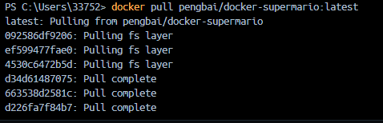

On peut voir que l'image a bien été récupérée et ajoutée à mes images:

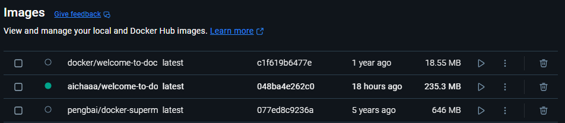

# Ensuite j'assigne le port 8600 à l'image:

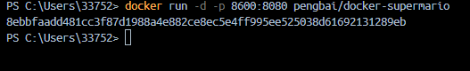

On peut voir que le port a bien été assigné:

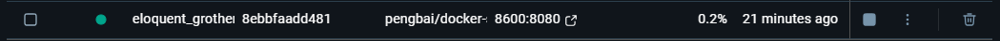

# Lancement d'une autre image sous un autre port:

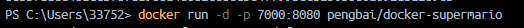

# Ouverture dans le navigateur et lancement d'une partie:

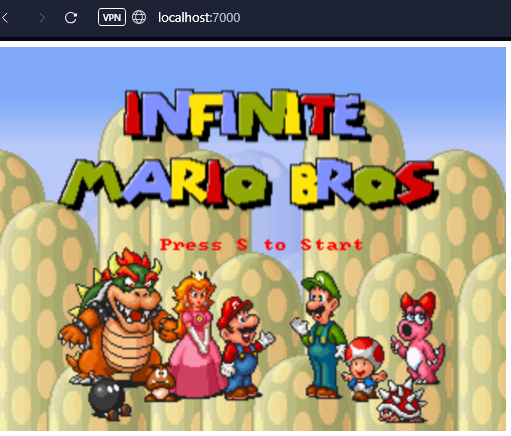

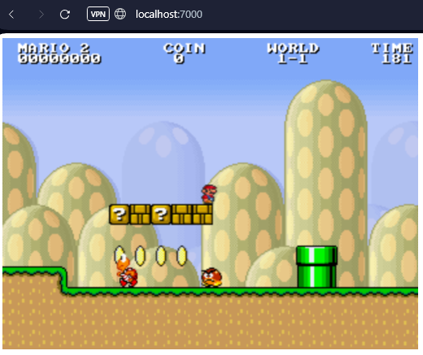

# Stoppage du container par son ID:

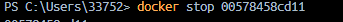

On peut voir que le container est à présent inactif (la pastille verte a disparu)

# Suppression du container par son nom:

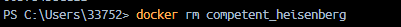

Suite à ça, le container a bien disparu.

# Suppression de l'image par son ID:

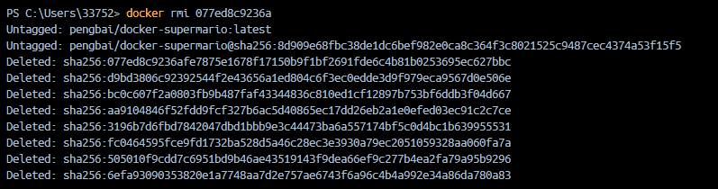

L'image pengbai/docker-supermario a bien été supprimée

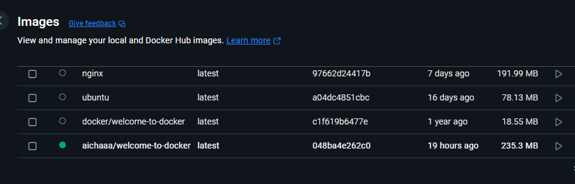

