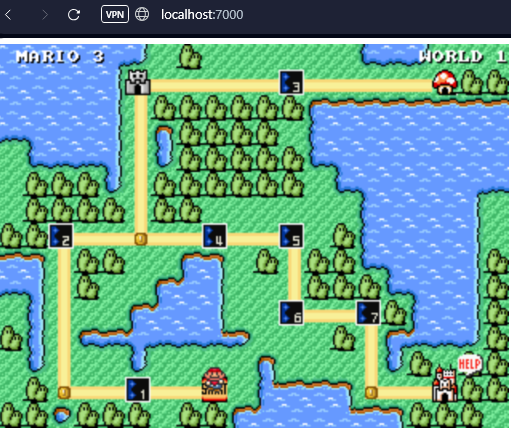

### Jour 1 - Job 03

# Récupération de l'image pengbai/mario

On peut voir que l'image a bien été récupérée et ajoutée à mes images:

Ensuite j'assigne le port 8600 à l'image:

On peut voir que le port a bien été assigné:

Lancement d'une autre image sous un autre port:

Ouverture dans le navigateur et lancement d'une partie:

