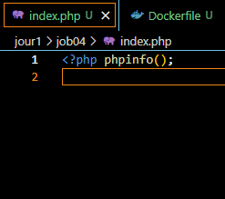
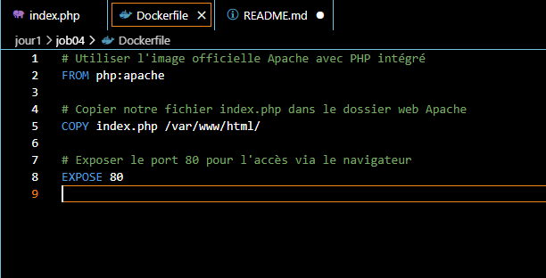
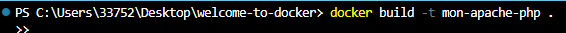
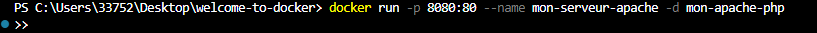

# Jour 01 - Job 04

### FICHIER PHP AFFICHANT LES INFOS SUR LE SERVEUR

### CREATION DU FICHIER DOCKERFILE ET ENVIRONNEMENT APACHE

### CONSTRUCTION DE L'IMAGE DOCKER

### LANCEMENT DU CONTAINER

### STOPPAGE DU CONTAINER

