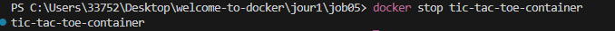

## Jour 3 - Job 5

### Création du Dockerfile

Après avoir créé les fichiers index.html, save.php et results.json, je rédige mon Dockerfile:

### IMAGE DOCKER "TIC-TAC-TOE"

### VOLUME DOCKER "game-results"

### EXECUTER LE CONTAINER SUR LE PORT 8080

### COMMANDE QUI VERIFIE LA CREATION DU VOLUME 

### CONTENU DU CONTAINER

### AFFICHER LE CONTENU DE RESULTS.JSON

### RESULTATS PARTIES

après avoir joué plusieurs parties , j'affiche les resultats dans Docker desktop (volumes -> results.json)

### STOPPER LE CONTAINER

