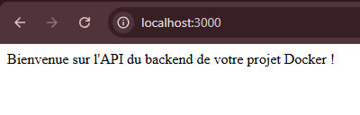
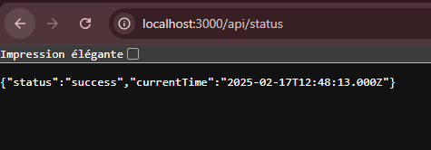
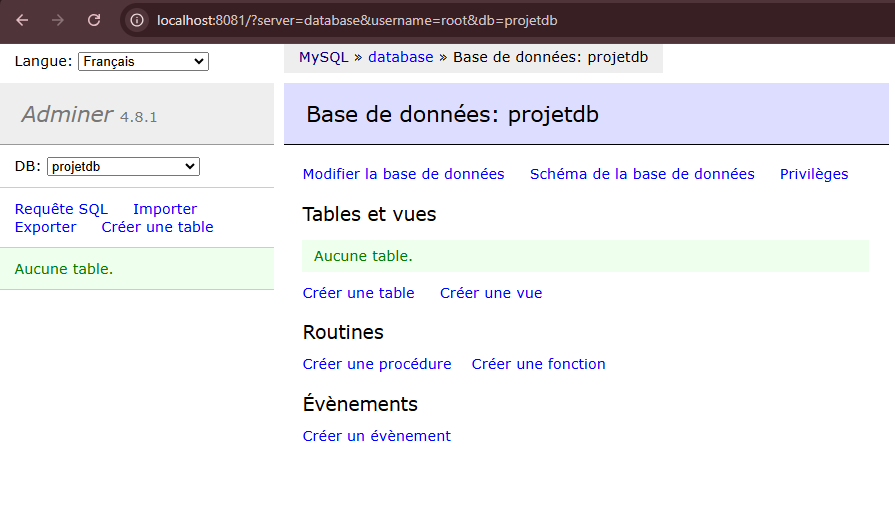
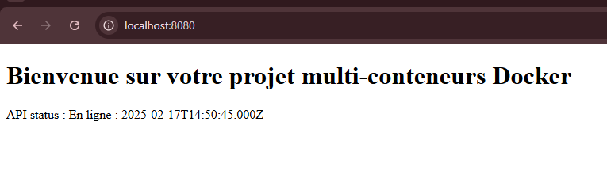
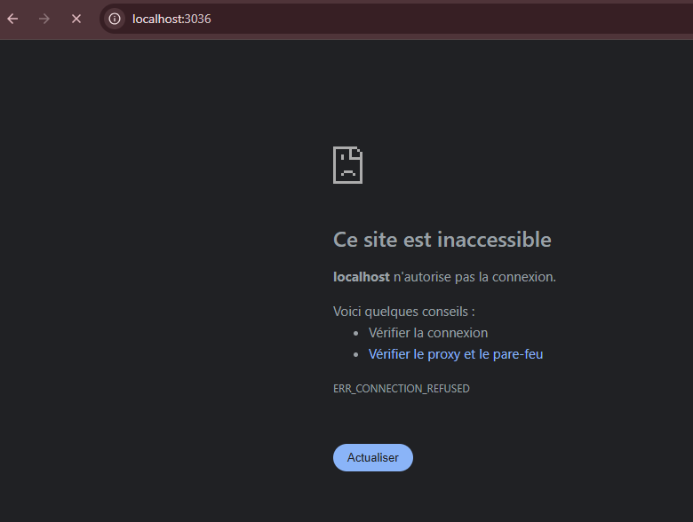
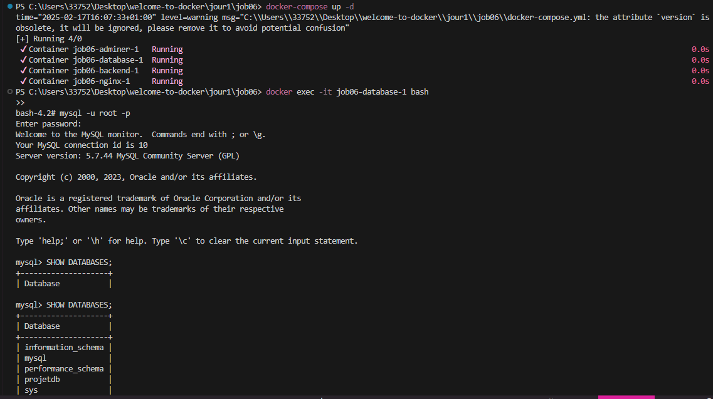
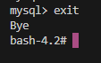

## ETAPE 1

  

## ETAPE 2

 

## ETAPE 3

 

  

## ETAPE 4

1.Accès au backend via http://localhost:3000 :

 
 

 2.Accès au frontend via http://localhost:8080 affichant l'état de
l'API.

 

 3.Accès à mysql via http://localhost:3306 :

 

 4. Accès sql, visualisation de la database et quitter:

 

  

  

  

 
 

